```mermaid
graph TB
    Start([Developer Pushes Code]) --> Branch{Which Branch?}
    
    Branch -->|Feature Branch| PR[Create Pull Request]
    Branch -->|Main/Master| Deploy
    
    PR --> CI[CI Pipeline Runs]
    CI --> Lint[ESLint Check]
    CI --> Type[Type Check]
    CI --> Build[Build Test]
    CI --> Test[Run Tests]
    CI --> Security[Security Scan]
    
    Lint --> Status{All Checks Pass?}
    Type --> Status
    Build --> Status
    Test --> Status
    Security --> Status
    
    Status -->|Yes| Preview[Preview Deployment]
    Status -->|No| Fail[Pipeline Failed ❌]
    
    Preview --> Review[Code Review]
    Review --> Approve{Approved?}
    
    Approve -->|Yes| Merge[Merge to Main]
    Approve -->|No| Changes[Request Changes]
    
    Changes --> PR
    
    Merge --> Deploy[CD Pipeline]
    Deploy --> BuildProd[Build Production]
    BuildProd --> DeployVercel[Deploy to Vercel]
    DeployVercel --> Health[Health Check]
    
    Health --> Live{Healthy?}
    Live -->|Yes| Success[✅ Live in Production]
    Live -->|No| Rollback[Alert & Rollback]
    
    Fail --> Notify[Notify Developer]
    Notify --> Fix[Fix Issues]
    Fix --> Start
    
    style Start fill:#4CAF50
    style Success fill:#4CAF50
    style Fail fill:#f44336
    style Rollback fill:#ff9800
```

# CI/CD Pipeline Flow Diagram

This diagram illustrates the complete CI/CD pipeline for Dev-Events.

## Pipeline Stages

### 1. Code Push
- Developer pushes code to GitHub
- Pipeline automatically triggered

### 2. Branch Detection
- **Feature Branch**: Runs CI + Preview
- **Main Branch**: Runs CI + CD

### 3. CI Pipeline
Runs in parallel:
- ✅ ESLint code quality check
- ✅ TypeScript type validation
- ✅ Production build test
- ✅ Test suite execution
- ✅ Security vulnerability scan

### 4. Status Check
- All checks must pass
- Failure stops the pipeline
- Developer notified of issues

### 5. Preview Deployment (PRs only)
- Creates preview on Vercel
- Posts URL in PR comment
- Updates on each push

### 6. Code Review
- Manual review by maintainers
- Automated checks already passed
- Request changes if needed

### 7. Merge to Main
- Approved PR merged
- Triggers CD pipeline
- Production deployment starts

### 8. CD Pipeline
Sequential steps:
1. Build for production
2. Deploy to Vercel
3. Run health checks
4. Verify deployment

### 9. Production
- ✅ Live and accessible
- 📊 Monitoring active
- 🔄 Ready for next deployment

## Quick Reference

| Event | Pipeline | Actions |
|-------|----------|---------|
| Push to feature branch | CI | Lint, Type, Build, Test, Security |
| Create/Update PR | CI + Preview | All CI checks + Preview deploy |
| Merge to main | CI + CD | All CI checks + Production deploy |
| Security alert | CodeQL | Weekly scan + Alert |
| Dependency update | Dependabot | Auto PR + Auto merge (safe) |

## Estimated Times

- CI Pipeline: ~3-5 minutes
- Preview Deploy: ~2-3 minutes
- Production Deploy: ~3-4 minutes
- Total (PR → Production): ~10-15 minutes

## Auto-Recovery

- Failed builds stop deployment
- Health check failures trigger alerts
- Dependabot auto-updates minor versions
- CodeQL scans weekly for vulnerabilities
